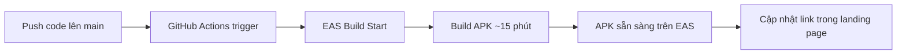

# 🔧 Setup Auto-Build APK khi Push lên Main

## Bước 1: Tạo EXPO_TOKEN

### Cách 1: Dùng EAS CLI (Khuyên dùng)
```bash
# Login vào EAS
npx eas login

# Tạo token mới
npx eas token:create

# Copy token hiển thị ra
```

### Cách 2: Qua Expo Dashboard
1. Vào: https://expo.dev/accounts/khanhtpse173570/settings/access-tokens
2. Nhấn **Create Token**
3. Name: `GitHub Actions`
4. Copy token

---

## Bước 2: Thêm EXPO_TOKEN vào GitHub Secrets

1. Vào: https://github.com/khanh173570/mobile-capstone/settings/secrets/actions/new
2. Name: `EXPO_TOKEN`
3. Secret: (paste token vừa tạo ở bước 1)
4. Nhấn **Add secret** ✅

---

## Bước 3: Lấy EAS Project ID

```bash
# Nếu chưa có project
npx eas init

# Hoặc xem project ID hiện tại
npx eas project:info
```

Copy **Project ID** (dạng: `xxxxxxxx-xxxx-xxxx-xxxx-xxxxxxxxxxxx`)

---

## Bước 4: Thêm Project ID vào app.json

Mở file `app.json` và thêm:

```json
{
  "expo": {
    "name": "AgriMart Management",
    "slug": "bolt-expo-nativewind",
    "owner": "khanhtpse173570",
    "version": "1.0.0",
    "extra": {
      "eas": {
        "projectId": "YOUR_PROJECT_ID_HERE"
      }
    }
  }
}
```

**Hoặc** tạo file `app.config.js`:

```javascript
export default {
  expo: {
    extra: {
      eas: {
        projectId: process.env.EAS_PROJECT_ID || "YOUR_PROJECT_ID_HERE"
      }
    }
  }
}
```

---

## Bước 5: Thêm EAS_PROJECT_ID vào GitHub Secrets (Nếu dùng app.config.js)

1. Vào: https://github.com/khanh173570/mobile-capstone/settings/secrets/actions/new
2. Name: `EAS_PROJECT_ID`
3. Secret: (paste Project ID)
4. Nhấn **Add secret**

---

## Bước 6: Test Auto-Build

```bash
# Commit và push
git add .
git commit -m "test: Trigger auto-build"
git push origin main
```

Theo dõi build tại:
- **GitHub Actions**: https://github.com/khanh173570/mobile-capstone/actions
- **EAS Dashboard**: https://expo.dev/accounts/khanhtpse173570/projects/agrimart-shop/builds

---

## ✅ Kết quả

Sau khi setup xong:

1. **Mỗi lần push lên main** → Tự động trigger build APK
2. **Build xong** (10-20 phút) → APK có sẵn trên EAS
3. **Cập nhật link** trong landing page (thủ công hoặc tự động)

---

## 🎯 Workflow hoạt động như thế nào?



---

## 🔄 Quy trình từ giờ:

1. **Code thay đổi** → Push lên main
2. **GitHub Actions** tự động trigger EAS build
3. **Đợi ~15 phút** build hoàn tất
4. **Lấy link APK mới** từ EAS builds
5. **Cập nhật link** trong `download-app.html` và `index.html`
6. **Push lại** → Landing page tự động deploy

---

## 💡 Tips

- Build chỉ chạy khi có thay đổi code (không chạy khi chỉ sửa .md, html)
- Có thể trigger thủ công từ GitHub Actions tab
- Kiểm tra logs nếu build fail
- Mỗi build có link download riêng, lưu lại để rollback nếu cần

---

**Cần hỗ trợ thêm?** Hỏi mình nhé! 🚀
